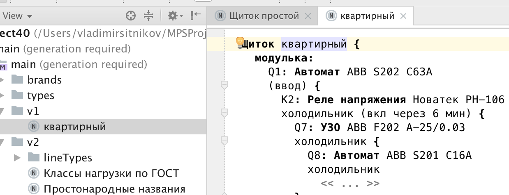
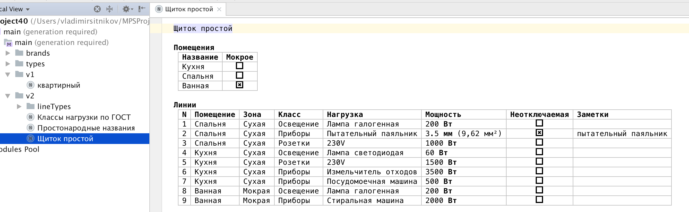

Electro: проектирование щитов
=============================

О программе
-----------

При проведении ремонта в квартире/доме возникает вопрос "как проектировать электрощит".
Разумеется, есть "большие и платные" программы, но нужны ли они для одного-двух щитков?
Подобный вопрос поднимался на [Mastergrad](http://www.mastergrad.com/forums/t252627-programma-dlya-proektirovaniya-shchitov/)

Начало работы
-------------

Последнюю версию можно скачать по адресу https://github.com/vlsi/electro/releases/latest

Для работы Electro нужна Java JDK 1.8 (версия должна быть именно 8, а не 9). JDK можно взять тут: http://www.oracle.com/technetwork/java/javase/downloads/jdk8-downloads-2133151.html
Если не запускается, то в начало `electro.bat` можно добавить `SET JAVA_HOME=C:\Program Files\Java\jdk1.8.0_92` (с правильным путём к Java JDK 1.8)

Для создания проекта нужно нажать "create project", выбрать "пример щита", немного подождать.

Как оно выглядит
----------------

Стоит учитывать, что сейчас программа является прототипом, т.е. не стоит думать, что в ней можно спроектировать сложный щит.

На текущий момент, можно задокументировать следующее:

Donate
------

Electro is a free product. You can use it as you wish, hover if you like, please consider donating some money to support the project.
Here are the ways you can donate money:

Flattr: 

Yandex.money: http://yasobe.ru/na/hardellaide or https://money.yandex.ru/to/410013031807962

Paypal: https://www.paypal.me/VladimirSitnikov

Лицензия
--------

MIT

История верий
-------------

Next:

v1.0.0: 17 Ноября 2017
- Прототип

Автор
-----
Vladimir Sitnikov <sitnikov.vladimir@gmail.com>
